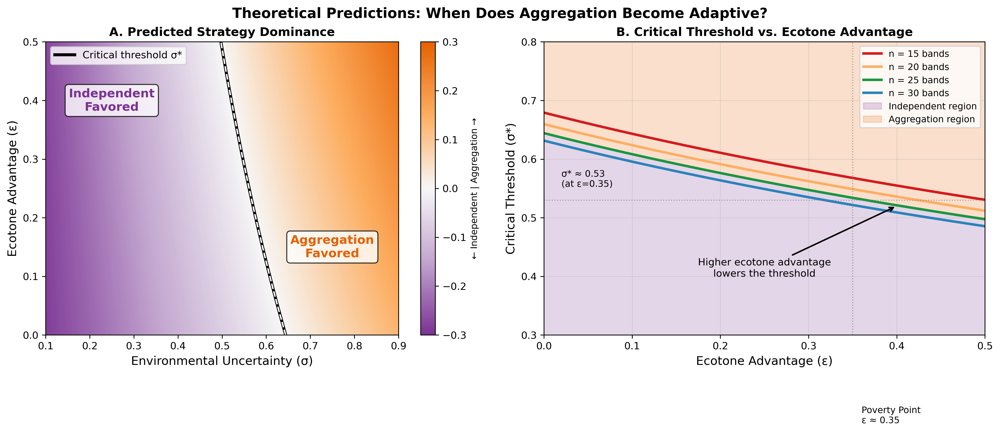
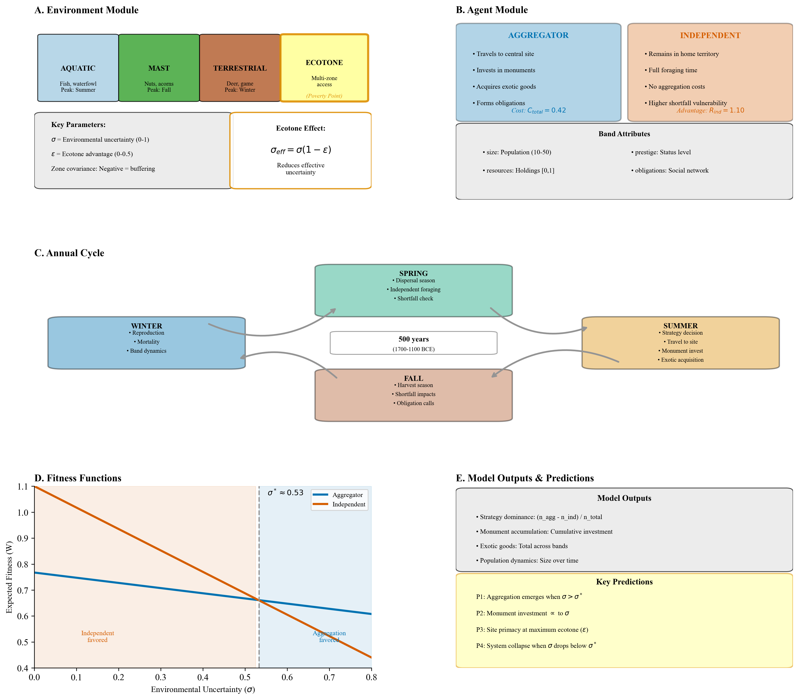
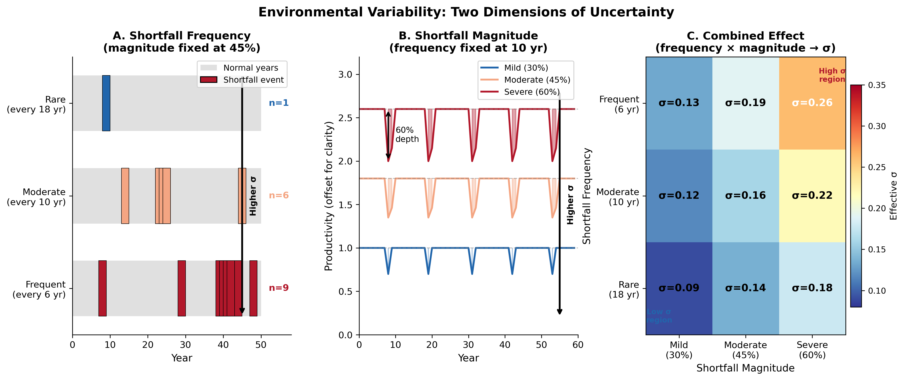
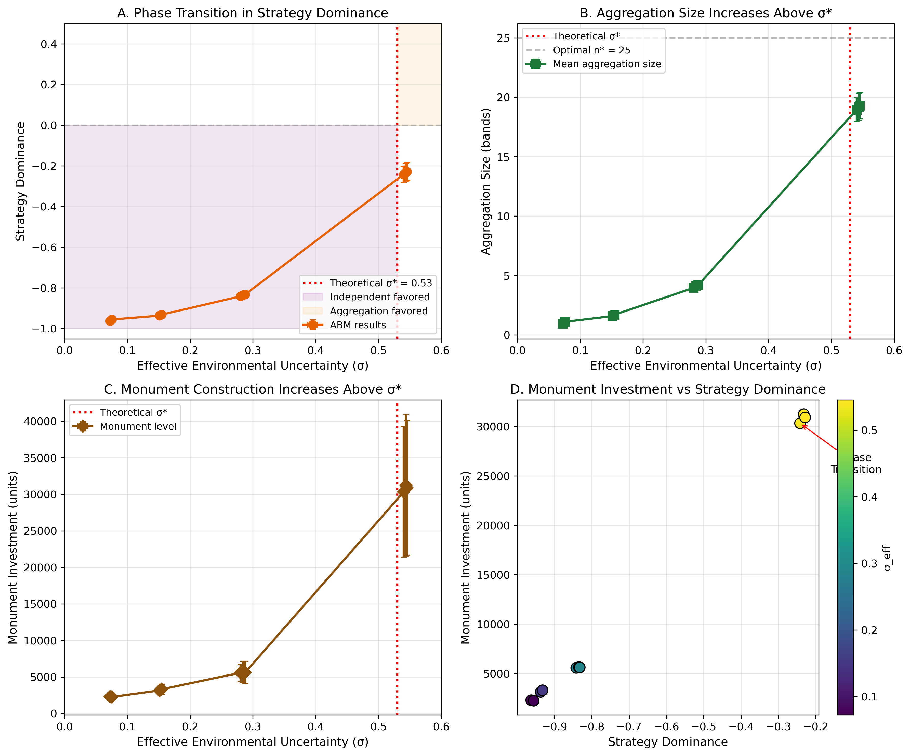
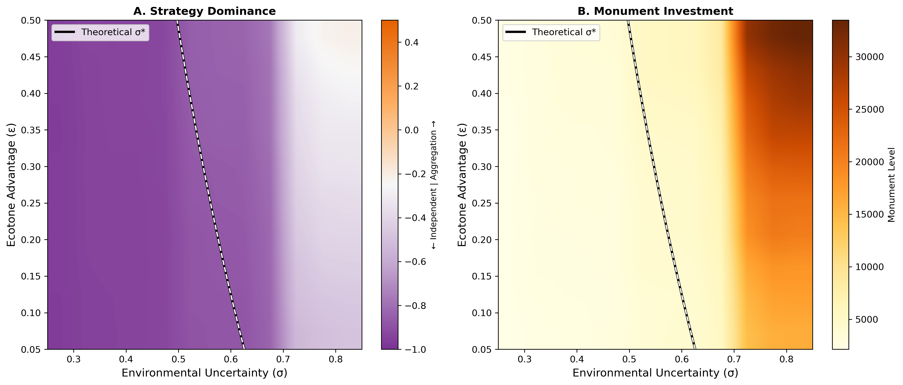
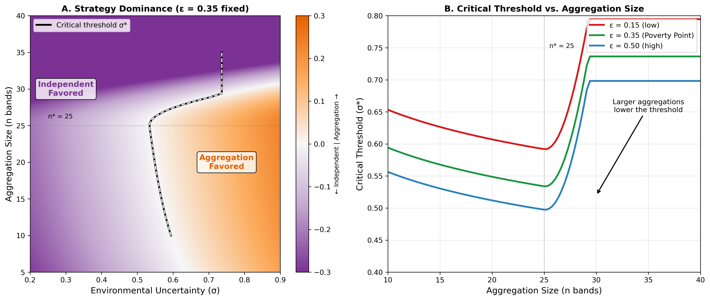
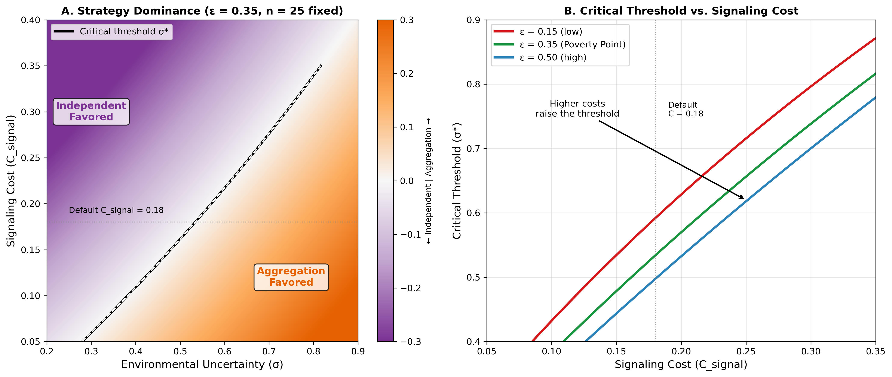
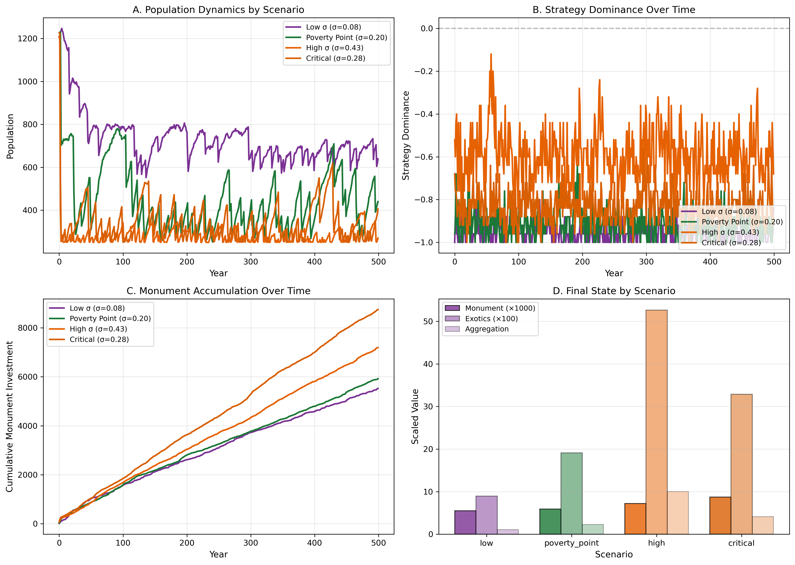
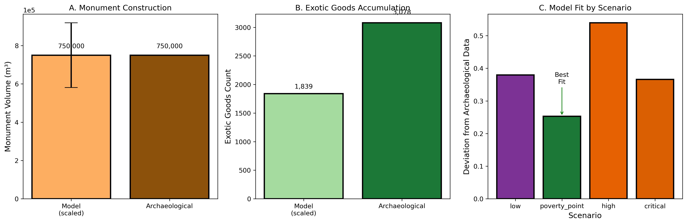
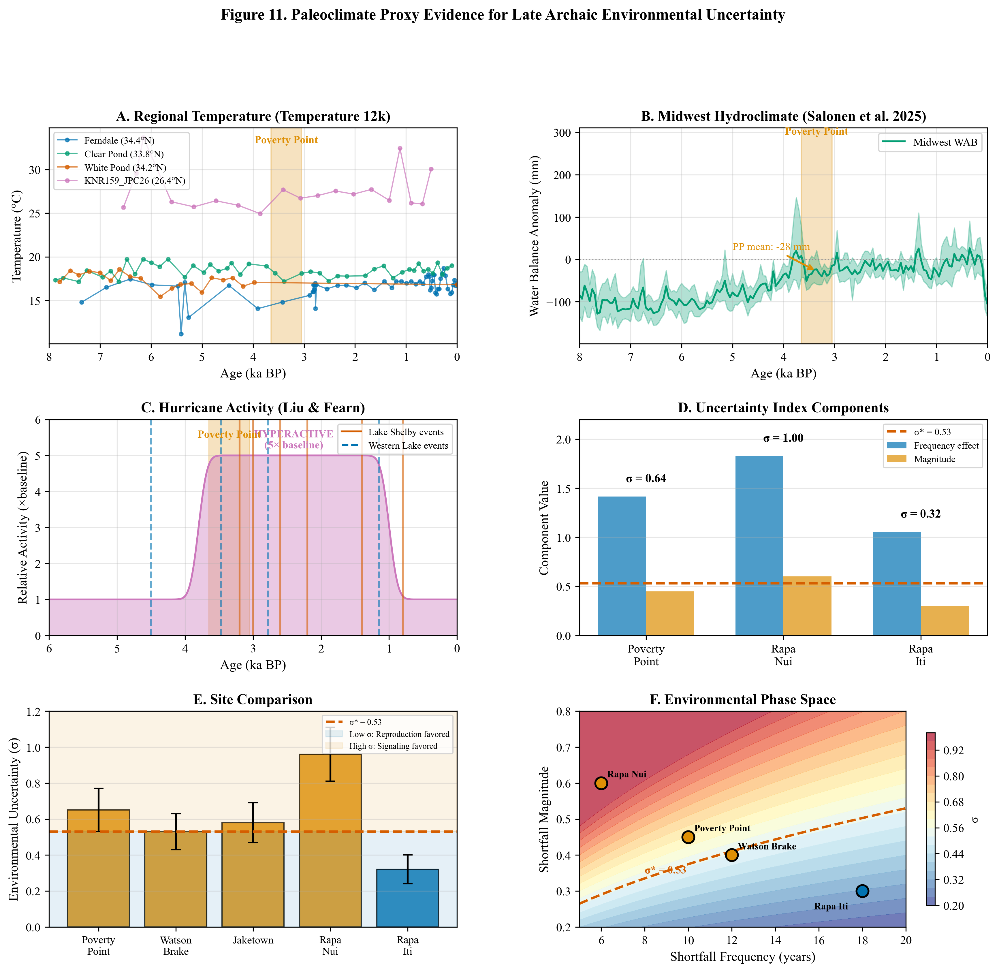

# The Poverty Point Paradox: Explaining Hunter-Gatherer Monumentality Through Costly Signaling Theory

**Running title:** Costly Signaling at Poverty Point

**Authors:** [Author names to be added]

**Corresponding author:** [Contact information to be added]

**Keywords:** Poverty Point, costly signaling, multilevel selection, hunter-gatherer archaeology, agent-based modeling, monumental architecture, Late Archaic

---

## Abstract

Poverty Point (ca. 1700-1100 BCE) presents one of archaeology's most compelling puzzles: why would mobile hunter-gatherers construct one of the largest earthwork complexes in prehistoric North America while simultaneously accumulating exotic materials from across the midcontinent? Standard models of hunter-gatherer behavior predict mobility and minimal investment in fixed infrastructure, yet Poverty Point encompasses 160 hectares of constructed landscape including massive mounds and concentric ridges representing millions of person-hours of labor. We propose that this phenomenon represents an adaptive costly signaling system operating through seasonal aggregation dynamics. Extending multilevel selection theory, we develop a formal model where environmental uncertainty above a critical threshold favors aggregation-based cooperation, with monument construction and exotic goods serving as honest signals of commitment. Our agent-based simulation validates the theoretical predictions, demonstrating a phase transition at environmental uncertainty levels consistent with Late Archaic conditions in the Lower Mississippi Valley. The model produces monument volumes and exotic goods quantities matching archaeological estimates when calibrated to the 500-year occupation span. This framework explains not only why monumentality emerged at Poverty Point but also predicts site location optimality based on ecotone access, regional site hierarchy, and conditions for eventual system abandonment. The costly signaling approach provides a unified explanation for collective monument construction and individual exotic goods acquisition without requiring aggrandizers, religious motivation, or incipient complexity.

---

## 1. Introduction

Poverty Point, located in northeastern Louisiana near the confluence of Bayou Macon and the Arkansas River, presents one of the most remarkable archaeological sites in North America (Figure 1; Gibson 2000, 2001). Dating to approximately 1700-1100 BCE, the site encompasses approximately 160 hectares of constructed landscape, including six concentric C-shaped ridges, multiple mounds, and a 17-hectare central plaza (Figure 2; Kidder 2002; Webb 1968). Mound A, the largest earthwork, rises 22 meters and contains an estimated 238,000 cubic meters of fill (Ortmann and Kidder 2013). Conservative estimates suggest the total earthwork volume exceeds 750,000 cubic meters, representing 1-5 million person-hours of labor investment (Sherwood and Kidder 2011). Recent geoarchaeological research indicates that Mound A may have been constructed in a matter of months rather than generations, implying coordinated labor mobilization at unprecedented scales for hunter-gatherer societies (Kidder et al. 2009; Ortmann and Kidder 2013).

***Figure 1. Location of Poverty Point.*** *[PLACEHOLDER: Map showing the location of Poverty Point in northeastern Louisiana, near the confluence of Bayou Macon and the Arkansas River. The map should show the Lower Mississippi Valley region and indicate the site's position at the intersection of multiple ecological zones.]*

***Figure 2. Poverty Point monumental architecture.*** *[PLACEHOLDER: Aerial or reconstruction image showing the site's monumental features including the six concentric C-shaped ridges, Mound A (Bird Mound), Mound B, and the central plaza. Scale bar should indicate the 160-hectare extent of the constructed landscape.]*

The site also served as a focal point for long-distance exchange networks spanning much of eastern North America (Webb 1968; Gibson 1999). Materials sourced from distances exceeding 1,600 kilometers accumulated at Poverty Point in quantities far exceeding any contemporary location. These include copper from eastern sources including the Appalachians and Canadian Maritimes (Hill et al. 2016), galena from Missouri, steatite from the Appalachians, and various lithic materials from across the midcontinent (Smith 1976; Lehmann 1991). The combination of massive collective monument construction with extensive individual acquisition of exotic materials demands explanation.

This pattern is paradoxical when viewed through standard models of hunter-gatherer behavior. Ethnographic and archaeological evidence suggests that mobile foraging populations typically minimize investment in fixed infrastructure, maintain flexible group membership, and avoid accumulation of surplus beyond immediate needs (Jackson 1986; Jackson and Scott 2001). The Poverty Point phenomenon appears to violate these expectations fundamentally. Why would mobile bands invest so heavily in monuments they would periodically abandon? Why acquire exotic materials with no apparent utilitarian function? Why create such pronounced site hierarchy in an otherwise dispersed settlement system?

Previous explanations have invoked several mechanisms, each facing significant challenges. "Big Man" or aggrandizer models propose that powerful individuals mobilized labor through prestige competition (Gibson and Carr 2004), but these accounts assume rather than explain why others participated in what appears to be collective action benefiting elites. Pilgrimage or ritual models describe the phenomenon as religious gatherings (Spivey et al. 2015), but provide no explanation for why this location, why such investment levels, or why the system eventually ended. Trade center models explain the exotic materials but fail to account for monument construction, which has no obvious role in exchange (Gibson 1999). Incipient sedentism models conflict with artifact distributions and site structure suggesting continued residential mobility for most participants (Jackson 1986).

We propose an alternative explanation grounded in evolutionary theory: Poverty Point represents an adaptive costly signaling system operating through seasonal aggregation dynamics. Building on the multilevel selection framework developed for explaining monument construction in territorial societies (DiNapoli et al. 2021; Lipo et al. 2016), we extend the theory to incorporate the specific challenges faced by mobile hunter-gatherer bands. Our model shows that under appropriate environmental conditions, aggregation with costly signaling emerges as a fitness-enhancing strategy, with both monument construction and exotic goods acquisition serving as honest signals of cooperation capacity and commitment.

The remainder of this paper develops this argument in four sections. Section 2 presents the theoretical framework, deriving the conditions under which aggregation-based costly signaling becomes adaptive. Section 3 describes an agent-based model that formalizes these dynamics. Section 4 presents simulation results validating the theoretical predictions and comparing model outputs to archaeological data. Section 5 discusses implications and identifies testable predictions that distinguish our model from alternatives.

---

## 2. Theoretical Framework

### 2.1 The Price Equation and Multilevel Selection

Our approach builds on the Price equation for multilevel selection (Price 1970), which provides a formal framework for understanding how traits can evolve when selection operates simultaneously at multiple levels. The Price equation partitions evolutionary change in trait frequency into between-group and within-group components:

$$\Delta\bar{p} = \frac{Cov(w_g, p_g)}{\bar{w}} + \frac{E(w_g \Delta p_g)}{\bar{w}}$$

where $p_g$ is the frequency of the trait (here, costly signaling) in group $g$, $w_g$ is the fitness of group $g$, $\bar{w}$ is mean population fitness, $\Delta p_g$ is the change in trait frequency within group $g$, and the two terms represent between-group and within-group selection respectively.

The first term, the covariance between group fitness and trait frequency, represents **between-group selection**. When groups with more signalers have higher fitness (positive covariance), this term favors the spread of signaling. The second term, the expected within-group change weighted by group fitness, represents **within-group selection**. Because signalers pay costs that non-signalers avoid, non-signalers typically out-reproduce signalers within any group, making this term negative.

The key insight from this framework is that costly traits can spread when between-group selection is sufficiently strong to overcome within-group costs. We extend this by making fitness explicitly dependent on environmental uncertainty ($\sigma$):

$$\Delta\bar{p} = \frac{Cov(w_g(\sigma), p_g)}{\bar{w}(\sigma)} + \frac{E(w_g(\sigma) \Delta p_g)}{\bar{w}(\sigma)}$$

Environmental uncertainty modulates the relative strength of these selective forces. At low $\sigma$, environmental shortfalls are rare, survival differences between strategies are minimal, and within-group selection dominates. Signaling is maladaptive because signalers pay costs without receiving commensurate survival benefits. At high $\sigma$, shortfalls are frequent and severe, survival differences become pronounced, and between-group selection strengthens. Groups with signalers survive shortfalls better due to cooperation networks, buffering mechanisms, and reduced vulnerability. Above a critical threshold $\sigma^*$, between-group selection overcomes within-group costs, and signaling becomes adaptive.

Previous applications of this framework to Rapa Nui moai construction and Chaco Canyon great houses demonstrated that this phase transition produces qualitatively different behavioral regimes. Below threshold, populations converge on non-signaling strategies; above threshold, costly signaling emerges and persists. The transition is sharp rather than gradual, creating distinct archaeological signatures.

### 2.2 From Territorial to Aggregation-Based Signaling

However, these territorial models cannot be directly applied to Poverty Point. The key differences involve social organization, spatial dynamics, and signal function. In the territorial model, groups are fixed in space and compete for resources through monument display that deters competitors. The signal says "we can defend this territory." Mobile hunter-gatherer bands face a fundamentally different optimization problem: they must decide whether to aggregate at central locations, how long to remain, and how much to invest in collective activities. The signal function shifts from deterrence to attraction, from territorial defense to cooperation facilitation. The signal says "we will cooperate reliably."

This shift requires modifying the fitness functions and introducing new mechanisms. Territorial groups gain fitness through reduced conflict mortality when monuments deter competitors. Aggregating bands gain fitness through cooperation benefits during aggregation and reciprocal obligations during dispersal. The cost structure also differs: territorial signalers pay continuous costs maintaining monuments, while aggregating signalers pay episodic costs during aggregation events.

### 2.3 The Aggregation Challenge

Hunter-gatherer bands face coordination and commitment problems that aggregation alone cannot solve. Without signaling mechanisms, aggregations are vulnerable to several challenges. Free-riding becomes possible when bands can extract cooperation benefits (information, mating opportunities, risk pooling) without contributing to collective activities. Partner identification becomes difficult when bands cannot distinguish reliable cooperators from potential exploiters. Commitment problems arise because bands have no incentive to return to the same aggregation site year after year without sunk costs binding them to the system.

Costly signaling through monument construction and exotic goods acquisition solves these problems (Zahavi 1975; Grafen 1990). Monument investment creates a sunk cost that demonstrates commitment to the aggregation system. A band that has invested heavily in monuments at a particular site has strong incentives to return, because abandoning the site means losing the value of past investment. Other bands can observe this commitment and preferentially cooperate with committed partners. Exotic goods signal individual capacity and willingness to invest in the network (Smith 1976; Hill et al. 2016). Bands that acquire exotic materials demonstrate resource surplus and network connectivity, signaling desirability as cooperation partners. Both signals are honest in the evolutionary sense because they cannot be cheaply faked: monuments require labor, exotics require network access and resource surplus.

### 2.4 Model Structure and Fitness Functions

We extend the multilevel selection framework to incorporate aggregation dynamics. Bands face a choice between two strategies each year. The **aggregator strategy** involves traveling to a central site during the aggregation season, investing in monuments and exotic goods, participating in collective activities, and forming reciprocal obligations with other aggregators. The **independent strategy** involves remaining dispersed throughout the year, avoiding aggregation costs, and foraging independently.

The fitness function for aggregators incorporates multiple components:

$$W_{agg}(\sigma, \varepsilon, n) = (1 - C_{total})(1 - \alpha_{agg} \cdot \sigma_{eff}) \cdot f(n) \cdot (1 + B_{recip})$$

where:

- $C_{total}$ represents total costs including travel ($C_{travel} \approx 0.08$), signaling investment ($C_{signal} \approx 0.15$), and foregone foraging ($C_{opportunity} \approx 0.19$), summing to approximately 0.42
- $\alpha_{agg}$ represents vulnerability to environmental shortfalls for aggregators, reduced by multi-zone buffering and risk pooling to approximately 0.40
- $\sigma_{eff}$ represents effective environmental uncertainty at the aggregation site, reduced by ecotone access
- $f(n)$ represents cooperation benefits as a function of the number of bands aggregating
- $B_{recip}$ represents benefits from reciprocal obligations that can be called upon during dispersal (approximately 0.05)

The fitness function for independents is simpler:

$$W_{ind}(\sigma) = R_{ind}(1 - \beta_{ind} \cdot \sigma)$$

where:

- $R_{ind}$ represents the reproductive advantage from avoiding aggregation costs (approximately 1.10, reflecting full resource allocation to reproduction)
- $\beta_{ind}$ represents vulnerability to shortfalls when foraging independently (approximately 0.75, reflecting single-zone dependence and lack of risk pooling)

The key asymmetry lies in vulnerability: aggregators have lower vulnerability ($\alpha_{agg} \approx 0.40$) than independents ($\beta_{ind} \approx 0.75$) because aggregation provides multi-zone resource access and reciprocal obligations create a social safety net during shortfalls.

### 2.5 Parameter Estimation and Justification

The parameter values used in the fitness functions derive from ethnographic observations, archaeological evidence, and theoretical constraints. While precise values for prehistoric populations cannot be directly measured, we can establish reasonable ranges based on comparative evidence and sensitivity analysis.

**Cost Parameters.** Travel costs ($C_{travel} \approx 0.12$) represent the energetic and time costs of moving to the aggregation site. Ethnographic studies of hunter-gatherer mobility suggest that long-distance travel consumes approximately 10-15% of available foraging time and energy (Kelly 2013). For Poverty Point, where participating bands may have traveled 50-200 km, we estimate travel costs at the upper end of this range. Signaling costs ($C_{signal} \approx 0.18$) encompass labor invested in monument construction and resources devoted to exotic goods acquisition. Archaeological estimates of labor investment at Poverty Point suggest approximately 1-5 million person-hours over the 500-year occupation (Sherwood and Kidder 2011). Distributed across participating bands and years, this translates to roughly 15-20% of available labor during aggregation seasons. Opportunity costs ($C_{opportunity} \approx 0.12$) reflect foregone foraging during the aggregation period. Ethnographic observations of seasonal aggregations suggest participants typically sacrifice 10-15% of annual foraging efficiency by concentrating activities at a single location rather than optimizing seasonal rounds (Conkey 1980).

**Vulnerability Parameters.** Independent vulnerability ($\beta_{ind} \approx 0.75$) represents the fitness impact of environmental shortfalls on dispersed bands lacking cooperation networks. This high value reflects the archaeological and ethnographic observation that isolated hunter-gatherer bands face severe consequences during resource failures, with mortality rates potentially reaching 20-30% during major famines (Kelly 2013). Aggregator vulnerability ($\alpha_{agg} \approx 0.40$) is substantially lower, reflecting multiple buffering mechanisms. Multi-zone resource access at ecotone locations reduces exposure to single-resource failures. Reciprocal obligation networks provide social insurance, with ethnographic evidence suggesting that well-connected individuals receive 40-60% more assistance during crises (Wiessner 2002). Information sharing during aggregation improves subsequent foraging efficiency. The ratio $\beta_{ind}/\alpha_{agg} \approx 1.9$ indicates that aggregators experience roughly half the shortfall impact of independents, consistent with observations that cooperation substantially buffers environmental risk in foraging societies.

**Cooperation Parameters.** The reproductive advantage for independents ($R_{ind} \approx 1.10$) reflects the fitness benefit of avoiding aggregation costs. Independents allocate all resources to subsistence and reproduction rather than diverting resources to travel, signaling, and collective activities. The 10% advantage is conservative, reflecting only the direct cost savings rather than any additional benefits from avoiding aggregation-related disease exposure or conflict. The reciprocal benefit rate ($B_{recip} \approx 0.05$) represents the average fitness enhancement from obligation networks during non-crisis periods, including improved foraging information, access to mates from other bands, and reduced intergroup conflict. Ethnographic evidence suggests that well-networked bands experience 3-8% higher reproductive success through these mechanisms (Wiessner 2002).

**Cooperation Benefit Parameters.** The cooperation benefit coefficient ($b \approx 0.08$) determines how rapidly benefits increase with aggregation size. This value produces cooperation benefits of approximately 1.26 at the optimal aggregation size of 25 bands, consistent with ethnographic observations that collective activities can improve foraging returns by 20-30% through information pooling, communal hunting, and labor sharing (Hayden 2014). The crowding cost coefficient ($c \approx 0.015$) determines how rapidly benefits decline above optimal size. This value ensures that aggregations larger than approximately 35 bands experience net crowding costs, consistent with observations that very large gatherings face resource depletion, sanitation problems, and coordination failures. The optimal aggregation size ($n^* \approx 25$ bands, or 500-625 individuals) falls within the range of ethnographically documented large hunter-gatherer gatherings, including Australian Aboriginal ceremonies, California acorn harvests, and Great Plains bison drives (Conkey 1980).

These parameter estimates produce a model that is sensitive to realistic variation in environmental and social conditions while generating predictions consistent with the archaeological record at Poverty Point.

### 2.6 The Ecotone Advantage

A critical innovation in our model is the ecotone advantage parameter ($\varepsilon$), which captures the benefits of multi-zone ecological access at the aggregation site. Poverty Point is positioned at the intersection of multiple ecological zones: Mississippi River floodplain aquatic resources, Macon Ridge upland terrestrial game, Bayou Macon drainage fish and waterfowl, and hardwood forest mast resources (Jackson 1986, 1989; Ward 1998).

When these zones have negative covariance in productivity, the ecotone provides variance reduction through portfolio effects. If aquatic resources fail due to drought, terrestrial resources may thrive; if mast crops fail, fish populations may be abundant. This reduces the effective uncertainty experienced at the aggregation site:

$$\sigma_{eff} = \sigma_{regional}(1 - \varepsilon)$$

For example, with regional uncertainty $\sigma = 0.60$ and ecotone advantage $\varepsilon = 0.35$, effective uncertainty at the aggregation site drops to $\sigma_{eff} = 0.39$. This substantially changes the fitness calculus for aggregation.

The ecotone advantage has profound implications for site location and regional hierarchy. It reduces effective uncertainty at the aggregation site while regional uncertainty remains high, creates an asymmetry that favors aggregation at high-ecotone locations, enables extended aggregation through diverse resource access (bands can stay longer without depleting local resources), creates site primacy for locations with maximum ecotone access (explaining why Poverty Point dominates the regional system), and lowers the critical threshold for aggregation to become adaptive.

### 2.6 Cooperation Benefits

The returns to aggregation show increasing then diminishing returns. Cooperation benefits increase with aggregation size due to information exchange about resource patches, collective fishing using weirs and communal drives, labor pooling for monument construction, and risk pooling through reciprocal obligations (Hayden 2009, 2014; Hays 2019). We model this as a logarithmic function:

$$f(n) = 1 + b \cdot \ln(n) - c \cdot (n - n^*)^2 \cdot \mathbb{1}_{n > n^*}$$

where $b \approx 0.08$ is the cooperation benefit coefficient, $c \approx 0.015$ is the crowding cost coefficient, and $n^* \approx 25$ is the optimal aggregation size before crowding costs emerge.

This functional form captures ethnographic observations that small aggregations provide substantial benefits (the first few bands add considerable value), marginal benefits decline with size (the 25th band adds less than the 5th), and above some threshold, crowding costs emerge from local resource depletion, disease transmission, and coordination difficulties. We estimate optimal aggregation size at approximately 25 bands (500-625 individuals) before crowding costs begin to dominate, consistent with ethnographic observations of large hunter-gatherer gatherings.

### 2.7 Critical Threshold

Setting the aggregator and independent fitness functions equal and solving for $\sigma$ yields the critical threshold $\sigma^*$ where aggregation becomes adaptive. After algebraic manipulation:

$$\sigma^* = \frac{R_{ind} - (1-C_{total}) \cdot f(n) \cdot (1+B_{recip})}{R_{ind} \cdot \beta_{ind} - (1-C_{total}) \cdot \alpha_{agg} \cdot (1-\varepsilon) \cdot f(n) \cdot (1+B_{recip})}$$

With our estimated parameters and $\varepsilon = 0.35$, $n = 25$:

- At zero ecotone advantage ($\varepsilon = 0$): $\sigma^* \approx 0.64$
- At moderate ecotone advantage ($\varepsilon = 0.35$): $\sigma^* \approx 0.53$
- At excellent ecotone advantage ($\varepsilon = 0.45$): $\sigma^* \approx 0.51$

The ecotone substantially lowers the threshold, making aggregation-based signaling adaptive under milder environmental uncertainty than would otherwise be required. This has important implications for site location: Poverty Point's ecotone position made aggregation viable under conditions that would not support aggregation at less advantageous locations.

Figure 3 illustrates these theoretical predictions across the full phase space defined by environmental uncertainty (σ) and ecotone advantage (ε). The critical threshold line separates the region where independent foraging is favored (lower-left) from the region where aggregation-based signaling becomes adaptive (upper-right). The figure also shows how the critical threshold varies with aggregation size, demonstrating that larger aggregations lower the threshold by increasing cooperation benefits.

***Figure 3. Theoretical predictions for strategy dominance.*** *(A) Predicted fitness difference (W_agg - W_ind) across the phase space defined by environmental uncertainty (σ, x-axis) and ecotone advantage (ε, y-axis). Purple shading indicates conditions where independent foraging yields higher fitness; orange shading indicates conditions where aggregation-based signaling is favored. The solid black line marks the critical threshold σ* where the two strategies yield equal fitness. (B) Critical threshold σ* as a function of ecotone advantage for different aggregation sizes. Higher ecotone advantage and larger aggregations both lower the critical threshold, making signaling adaptive under milder uncertainty. The dashed lines mark the estimated Poverty Point conditions (ε ≈ 0.35, σ* ≈ 0.53).*

---

## 3. Agent-Based Model

### 3.1 Model Overview

We developed an agent-based model (ABM) to formalize the theoretical framework, explore parameter space systematically, and validate analytical predictions against simulation outcomes. Agent-based modeling is particularly appropriate for this application because it captures individual-level decision-making, allows for emergent population-level patterns, incorporates spatial and temporal heterogeneity, and enables comparison of simulation outputs with archaeological data.

The model integrates three components: an environment module implementing multi-zone ecological dynamics with seasonal cycles and stochastic shortfalls, an agent module implementing band-level decision-making, strategy choice, and reproduction, and a simulation controller implementing the annual aggregation-dispersal cycle and tracking system-level outcomes. Figure 5 provides a visual overview of the complete model architecture, illustrating how these components interact through the annual cycle.

***Figure 5. Agent-based model architecture.*** *(A) The environment module implements four ecological zones with differential productivity; ecotone locations provide buffering against regional uncertainty (σ_eff = σ(1-ε)). (B) Bands choose between AGGREGATOR and INDEPENDENT strategies based on expected fitness comparison. (C) The annual cycle proceeds through four phases: spring dispersal and foraging, summer aggregation with monument investment and exotic acquisition, fall harvest with shortfall impacts, and winter reproduction. (D) Fitness functions show how the two strategies respond differently to environmental uncertainty; the critical threshold σ* determines which strategy dominates. (E) Model outputs include strategy dominance, monument accumulation, exotic goods totals, and population dynamics, producing predictions about when aggregation-based signaling should emerge.*

### 3.2 Environment Module

The environment module represents the Lower Mississippi Valley as a heterogeneous landscape structured around four distinct resource zones, each exhibiting characteristic productivity patterns and seasonal dynamics that would have shaped foraging decisions during the Late Archaic. This multi-zone structure is fundamental to understanding both the challenges faced by hunter-gatherer populations and the potential advantages of aggregation at ecotone locations like Poverty Point.

The aquatic zone encompasses the rich riverine and floodplain resources that characterized the Mississippi Valley during the Late Archaic, including fish, waterfowl, turtles, and shellfish. Archaeological evidence from Poverty Point and contemporary sites indicates that aquatic resources formed a substantial component of the subsistence base (Jackson 1986, 1989; Ward 1998). In the model, aquatic productivity peaks during spring and summer months when fish spawning runs coincide with waterfowl nesting and high water levels expand accessible wetland habitats. We parameterize base productivity at 0.8 with seasonal amplitude of 0.3, producing annual productivity values ranging from 0.5 during winter lows to 1.1 during peak availability. This high amplitude reflects the strongly seasonal nature of riverine productivity in subtropical floodplain environments.

The terrestrial zone represents the upland game resources available in the Macon Ridge and surrounding areas, primarily white-tailed deer, wild turkey, and various small mammals. Terrestrial productivity follows a complementary seasonal pattern, peaking in fall and winter when deer concentrate near mast-producing forests and reduced cover makes game more accessible. Base productivity is set at 0.7 with seasonal amplitude of 0.25, reflecting somewhat less pronounced seasonality than aquatic resources but still substantial variation across the annual cycle. The fall peak in terrestrial productivity coincides with the mast harvest season, concentrating game animals in predictable locations and enabling efficient communal hunting strategies.

The mast zone models the hardwood forests that produced pecans, hickory nuts, acorns, and walnuts, resources that were critical to Late Archaic subsistence economies throughout the Eastern Woodlands. Mast productivity exhibits the most extreme seasonality of any resource type, with a sharp fall peak concentrated in September through November and near-zero productivity outside the harvest window. Beyond this pronounced seasonality, mast crops display substantial inter-annual variability, with periodic mast failures occurring when weather conditions disrupt flowering or nut development. This high variability makes mast resources simultaneously attractive (when abundant) and unreliable, creating a distinctive contribution to environmental uncertainty that differs qualitatively from the more predictable seasonal cycles of aquatic and terrestrial resources.

The ecotone zone represents the transitional areas where multiple resource types are accessible within a single foraging radius, precisely the configuration that characterizes Poverty Point's location at the intersection of floodplain, upland, and wetland environments. Ecotone productivity is more balanced across seasons, with base productivity of 0.6 but reduced seasonal amplitude (0.15). This lower amplitude reflects the portfolio effect of multi-zone access: when one resource type declines seasonally, others may be ascending, dampening overall variability. The ecotone configuration creates more stable year-round resource availability, reducing effective uncertainty for populations that can access this zone.

Seasonal productivity dynamics follow a sinusoidal function with zone-specific timing, capturing the fundamental annual rhythm that structured hunter-gatherer scheduling decisions. Each zone's productivity at month $t$ is calculated as $P_{zone}(t) = P_{base} + A \cdot \sin(2\pi(t - \phi)/12)$, where $P_{base}$ represents the zone's baseline productivity, $A$ is the seasonal amplitude, and $\phi$ is the phase shift determining when productivity peaks. Aquatic zones peak in June when spawning runs and waterfowl concentrations reach maximum, terrestrial zones peak in November when deer and game are concentrated, and mast zones peak in October during the nut harvest. This staggered timing of peak productivity across zones creates opportunities for scheduling mobility to track seasonal resource availability, a pattern well documented in ethnographic and archaeological studies of temperate hunter-gatherers.

Beyond deterministic seasonal cycles, each zone experiences stochastic inter-annual variation drawn from a multivariate normal distribution with specified covariance structure. This covariance structure is critical to understanding the ecotone advantage. Zones exhibit negative covariance with each other, representing the ecological buffering that makes multi-zone access valuable. For example, aquatic-terrestrial covariance is set at -0.3, meaning that years with below-average fish productivity tend to coincide with above-average hunting success, and vice versa. This negative covariance reflects the underlying meteorological reality that conditions favoring one resource type often disfavor others: drought years that reduce aquatic productivity may concentrate game in remaining water sources, improving hunting success. The portfolio effect created by negative covariance between zones provides the mechanistic basis for the ecotone advantage parameter $\varepsilon$ in the fitness equations.

Environmental shortfalls represent the major disruptions that periodically destabilized Late Archaic subsistence systems, including severe droughts, exceptional floods, and widespread mast failures. Paleoclimate reconstruction for the Lower Mississippi Valley indicates substantial climate variability during the Late Archaic, with evidence for periodic drought episodes and hydrological fluctuations (Kidder 2006). The model characterizes shortfalls through three interacting parameters that jointly determine the composite environmental uncertainty measure $\sigma$.

Shortfall frequency governs how often major disruptions occur. Each simulation year, the probability of a new shortfall initiating equals $1/\text{mean\_interval}$. For the Poverty Point scenario calibrated to paleoenvironmental evidence, the mean interval is 10 years, producing a shortfall probability of approximately 0.10 per year. This frequency means that over a 500-year simulation, populations experience approximately 50 major environmental disruptions, consistent with expectations for a subtropical environment subject to ENSO-related climate variability and periodic Atlantic hurricane impacts.

Shortfall magnitude determines the severity of productivity reduction during disruptions. When a shortfall is triggered, magnitude is drawn from a normal distribution centered on the scenario mean with modest variance. A magnitude of 0.45 means that productivity across all zones drops to 55% of normal values, representing a substantial but not catastrophic reduction. Magnitudes can range from mild (0.20, representing a poor year but not a crisis) to severe (0.70 or higher, representing conditions that would have severely stressed hunter-gatherer populations).

Duration represents how long shortfalls persist before normal productivity resumes, and this parameter scales with magnitude through the relationship $\text{duration} = \max(1, \lfloor 1 + \text{magnitude} \times 2.5 \rfloor)$. This scaling captures the empirical observation that more severe environmental disruptions tend to persist longer: a mild shortfall (magnitude 0.20) lasts only one year and represents a poor season quickly followed by recovery, while a moderate shortfall (magnitude 0.50) persists for two years as depleted resources require time to regenerate, and a severe shortfall (magnitude 0.80) extends to three years as ecosystems require extended recovery periods. This duration scaling has important consequences for the model dynamics, because multi-year shortfalls create sustained selection pressure favoring cooperation and risk-pooling strategies.

The combination of frequency, magnitude, and duration determines effective environmental uncertainty through the relationship $\sigma \approx 5.0 \times (1/\text{frequency}) \times \text{magnitude} \times \sqrt{\text{duration}}$. This formulation captures the intuition that uncertainty increases when shortfalls occur more frequently, when shortfalls are more severe, and when shortfalls persist longer. A population experiencing rare, mild, brief shortfalls faces low effective uncertainty and should favor independent foraging strategies, while a population experiencing frequent, severe, prolonged shortfalls faces high effective uncertainty and should benefit from aggregation-based cooperation. Figure 4 illustrates how these two dimensions of environmental variability combine to produce different effective σ values, showing the distinct contributions of frequency and magnitude and their multiplicative interaction.

***Figure 4. Environmental variability: two dimensions of uncertainty.*** *(A) Shortfall frequency effects shown as horizontal timelines over 50 years. Each colored bar represents a shortfall event; gray bars show normal years. Rare shortfalls (every 18 years, blue) produce few events (n=2), while frequent shortfalls (every 6 years, red) produce many events (n=8). More frequent shortfalls increase effective σ. (B) Shortfall magnitude effects shown as productivity depth profiles over 60 years. Shortfalls occur at fixed intervals (every ~10 years) but vary in severity: mild (30%, blue) produces shallow dips, while severe (60%, red) produces deep, prolonged reductions. Shaded areas show the "depth" of each shortfall. Deeper shortfalls increase effective σ. (C) Combined effect of frequency and magnitude on effective σ. The heatmap shows simulated σ values for each combination of shortfall frequency (rows) and magnitude (columns). Low σ conditions (rare, mild shortfalls, lower-left) produce stable environments favoring independent foraging; high σ conditions (frequent, severe shortfalls, upper-right) produce uncertain environments favoring aggregation-based cooperation.*

### 3.3 Agent Module

The agent module models individual bands as the fundamental decision-making and reproductive units in Late Archaic hunter-gatherer societies. This level of abstraction reflects the ethnographic and archaeological consensus that bands, typically comprising 15-30 related individuals, were the primary social units making subsistence and mobility decisions in mobile foraging societies (Kelly 2013). Each band in the simulation maintains a set of state variables that evolve over time through foraging, decision-making, social interaction, and demographic processes.

Band size represents the number of individuals comprising the group, ranging from a minimum of 10 to a maximum of 50 with typical values around 20-25 individuals. These bounds reflect ethnographic observations of minimum viable group size for effective foraging and maximum sustainable size before fission becomes necessary due to coordination costs and local resource depletion. Band size affects multiple model processes: larger bands consume more resources per time step, can contribute more labor to monument construction during aggregation, and produce more offspring during reproduction phases. When bands fall below minimum viable size, they may merge with other small bands; when they exceed maximum size, they fission into daughter bands that inherit characteristics from the parent.

Each band occupies a home location represented as coordinates in the model's spatial domain. This home location represents the band's primary territory where members have detailed environmental knowledge and established foraging routines. Bands forage near their home location during dispersal seasons and return there after aggregation events. Home locations are fixed throughout the simulation, reflecting the territorial tendencies documented in many hunter-gatherer societies where bands maintain traditional use areas over generations. Distance from home location to the aggregation site determines travel costs for bands choosing to aggregate, creating spatial heterogeneity in the relative attractiveness of aggregation versus independent strategies.

Current strategy represents the band's choice between AGGREGATOR and INDEPENDENT modes of operation for the current year. This binary classification is updated annually based on expected fitness comparisons, reflecting the seasonal decision each band must make about whether to travel to the aggregation site or remain dispersed. Strategy choice is the primary behavioral variable driving model dynamics, and the population-level distribution of strategies determines aggregation size, monument investment, and system outcomes.

Resources represent accumulated food stores available to the band, bounded between 0 and 1 in normalized units. Resources are gained through foraging activities that depend on local zone productivity, consumed by band members at a per-capita rate, and are critical for multiple purposes. Sufficient resources are necessary for survival during environmental shortfalls, for investment in monument construction during aggregation, and for successful reproduction. Resource levels fluctuate throughout the annual cycle as bands harvest during productive seasons and draw down stores during lean periods.

Prestige accumulates through visible investments in the signaling system, primarily monument contributions and exotic goods acquisition. Bands with higher prestige are more attractive as cooperation partners and have increased probability of forming reciprocal obligations with other bands during aggregation events. Prestige decays slowly over time if not maintained through continued investment, reflecting the need for ongoing demonstration of commitment to the aggregation system. This decay mechanism ensures that bands cannot rest on past achievements but must continue investing to maintain their position in the social network.

Monument contributions track each band's cumulative investment in the aggregation site's earthwork infrastructure. When bands aggregate, they may choose to invest a portion of their resources in construction activities, adding both to their personal prestige and to the site's total monument accumulation. This dual function of monument investment captures the theoretical expectation that monuments serve simultaneously as individual signals (demonstrating the investing band's capacity) and collective goods (benefiting all aggregation participants through the infrastructure created).

Exotic goods holdings track each band's accumulated stock of exotic materials, representing copper, steatite, galena, and other non-local materials that circulated through the Poverty Point exchange network. Exotic acquisition probability increases with prestige and network connectivity, reflecting the observation that well-connected bands would have greater access to exchange opportunities. Exotic holdings serve as individual-level signals complementing the collective monument investment, demonstrating resource surplus and network position.

Reciprocal obligations form the social network that provides insurance benefits during environmental shortfalls. Each band maintains a dictionary mapping other bands to obligation strengths, where higher values indicate stronger mutual commitments. These obligations are formed during aggregation events, strengthened through repeated interaction, and can be called upon during periods of resource stress. The obligation network represents the "social insurance" that makes aggregation valuable even during non-shortfall years, because building and maintaining these networks requires regular participation.

The strategy decision process runs annually during the pre-aggregation period, as bands evaluate whether to travel to the aggregation site or remain dispersed. Rather than a simple fitness comparison, the decision algorithm incorporates expectations about aggregation attendance, personal history, and stochastic elements that prevent unrealistic lockstep behavior across the population.

Bands begin by estimating expected aggregation size based on the previous year's attendance, current environmental conditions, and their knowledge of other bands' recent strategies. This expected attendance determines the cooperation benefits term in the fitness calculation, because larger aggregations provide greater information exchange, risk pooling, and collective action opportunities. Bands then calculate expected fitness under aggregation using the full fitness function $W_{agg}$ with current environmental uncertainty $\sigma$, the aggregation site's ecotone advantage $\varepsilon$, and expected attendance $n$. They similarly calculate expected fitness under independent foraging using $W_{ind}$ with current $\sigma$.

The fitness difference $\Delta W = E[W_{agg}] - E[W_{ind}]$ provides the basis for strategy choice, but the choice is probabilistic rather than deterministic. Bands choose to aggregate with probability $P(\text{aggregate}) = 1/(1 + \exp(-\tau \cdot \Delta W))$, where the temperature parameter $\tau \approx 10$ controls decision determinism. This sigmoid function produces nearly deterministic choices when fitness differences are large (bands strongly prefer the clearly superior strategy) but more stochastic choices when fitness differences are small (bands near the indifference threshold make noisier decisions). The stochastic element prevents the population from converging to a single strategy in a single time step and creates the gradual transitions observed in the simulation results.

Memory effects introduce path dependence into strategy decisions, reflecting the plausible cognitive tendency to repeat strategies that previously succeeded and avoid strategies that previously failed. If a band aggregated in the previous year and experienced fitness improvement relative to its earlier state, the model adds a positive adjustment (+0.05) to the fitness difference, making aggregation slightly more attractive. Conversely, if aggregation was followed by fitness decline, a negative adjustment (-0.05) makes aggregation less attractive. Opposite effects apply for bands that remained independent. Over multiple years, these memory effects create persistence in strategy adoption, with bands that have succeeded under a particular strategy showing reluctance to switch even when conditions change. This memory mechanism produces the realistic feature that strategy transitions occur gradually as bands update their expectations rather than instantaneously as conditions cross thresholds.

Reciprocal obligation networks form during aggregation events and provide the mechanism through which aggregation benefits extend beyond the aggregation season itself. When bands aggregate, each pair of co-attending bands has a 20-30% probability of forming or strengthening a reciprocal obligation. New obligations initialize at strength 0.1, representing a weak but real commitment. Repeated co-aggregation in subsequent years increases obligation strength, capping at 1.0 for bands with long histories of mutual participation. This accumulation mechanism creates incentives for consistent aggregation: bands that aggregate sporadically fail to build strong obligation networks, while bands that aggregate regularly develop extensive, high-strength networks.

During dispersal periods, bands experiencing resource shortfalls can call upon their obligation networks for assistance. The help received equals $\min(\text{need}, \sum_{j} O_{ij} \times 0.5 \times R_j)$, where the band receives resources proportional to obligation strength and helper resources. This formula ensures that bands with stronger, more extensive networks receive more help during crises, translating the social investment of aggregation into concrete survival benefits. However, calling on obligations carries a cost: each request reduces the relevant obligation strength by 30%, reflecting the strain that requests for help place on social relationships. Bands that call on obligations too frequently deplete their networks and must reinvest through renewed aggregation to rebuild them. This depletion mechanism creates a tradeoff between using obligations in the short term and maintaining them for the long term, incentivizing the kind of reciprocity and restraint that ethnographic accounts suggest characterized successful exchange relationships.

### 3.4 Annual Cycle

The simulation implements a four-phase annual cycle that captures the seasonal round characteristic of Late Archaic hunter-gatherers in the Lower Mississippi Valley. This cyclical structure reflects the fundamental rhythm of mobile foraging societies, where subsistence activities, social interactions, and demographic processes follow predictable seasonal patterns driven by resource availability and environmental constraints.

The spring dispersal phase spans March through May, during which all bands forage independently near their home locations regardless of their strategic orientation. Aquatic zone productivity reaches its annual peak during this period as fish spawning runs intensify and waterfowl congregate in wetland habitats, favoring bands with access to riverine resources. Each band harvests resources based on zone productivity at their location, with harvest calculated as $\text{harvest} = P_{zone}(t) \times \text{foraging\_efficiency}$. For bands following the aggregator strategy, foraging efficiency during spring is reduced by opportunity cost (approximately 0.81 efficiency) because these bands must begin preparing for the upcoming aggregation journey, gathering supplies and coordinating with neighboring bands. Independent bands forage at full efficiency throughout this phase. Resource consumption during spring equals approximately 0.015 per capita per month, with net resources accumulating according to the balance of harvest and consumption, bounded within the normalized range of zero to one.

The summer aggregation phase from June through August represents the critical period when the aggregation decision is enacted. At the start of summer, each band executes its strategy decision algorithm to determine whether to travel to the aggregation site or remain dispersed for the current year. Bands choosing to aggregate first pay travel costs proportional to their distance from the aggregation site, then journey to the central location at Poverty Point. Upon arrival, aggregating bands gain access to ecotone resources, benefiting from the multi-zone productivity that characterizes the aggregation site's advantageous position. Bands with sufficient resources (exceeding 0.3 in normalized units) invest in monument construction, with investment calculated as $\text{investment} = \text{band\_size} \times \text{investment\_rate} \times R \times (0.8 + 0.4 \times \text{random})$, where the stochastic term introduces realistic variation in construction intensity across bands and years. Monument investment simultaneously enhances the investing band's prestige (by approximately 0.1 times the investment amount) and adds to the site's cumulative monument level, capturing the dual individual and collective functions of monument construction identified in the theoretical framework. Throughout the aggregation season, co-attending bands have opportunities to form or strengthen reciprocal obligations, with each pair having a 20-30% probability of establishing new ties or deepening existing relationships. Aggregating bands may also acquire exotic goods, with acquisition probability increasing with prestige and network connectivity. In contrast, bands remaining independent during summer continue foraging near their home locations, avoiding aggregation costs but missing the cooperation benefits and network-building opportunities that aggregation provides. Importantly, independent bands cannot form new reciprocal obligations during this phase, though existing obligations from previous aggregations persist and remain available for future activation.

The fall dispersal phase encompasses September through November and represents the primary harvest season for Late Archaic populations. All bands return to or remain at their home territories for intensive foraging as mast resources reach their sharp annual peak and terrestrial game concentrates near nut-bearing forests. Mast zone productivity during this period provides critical caloric surplus for the upcoming winter, and bands with access to productive mast stands receive substantial harvest bonuses. Aggregator bands may continue acquiring exotic goods during fall travel as they return to their home territories and encounter exchange opportunities along their routes. This season also marks when environmental shortfalls exert their strongest impact on population welfare, as failed mast crops and depleted game create severe resource stress precisely when bands are attempting to accumulate winter stores. The timing of shortfall effects during the critical fall harvest period amplifies their demographic consequences, creating the survival pressures that drive selection between strategies.

The winter phase from December through February serves as the mortality and reproduction period when the demographic consequences of strategic choices are realized. If an environmental shortfall is active, all zones experience reduced productivity scaled by the shortfall magnitude, creating widespread resource stress across the landscape. Bands face survival challenges whose severity depends critically on their strategic history. Aggregator bands can call upon their reciprocal obligation networks if resources drop below subsistence thresholds, receiving assistance from obligation partners proportional to relationship strength and partner resources. Independent bands face shortfalls alone, with only their stored resources to buffer against scarcity. This differential access to social insurance creates the survival advantage for aggregators that underlies the between-group selection component of the model. Mortality probability increases when resources are insufficient, following the relationship $P(\text{death}) = \max(0, (\text{threshold} - R) \times \text{mortality\_rate})$, with aggregators experiencing lower effective mortality because their obligation networks provide buffering that independents lack.

Surviving bands reproduce during winter based on their fitness and resource status, with births drawn from a binomial distribution: $\text{births} \sim \text{Binomial}(\text{band\_size}, \text{birth\_rate} \times \text{fitness} \times (0.5 + R))$. Fitness is calculated using the appropriate fitness function for the band's current strategy, and resource levels modulate reproductive success by scaling the probability of successful births. This fitness-based reproduction implements the core mechanism driving multilevel selection: strategies conferring higher fitness produce more offspring, gradually shifting population composition toward adaptive strategies over successive generations. Band sizes are constrained to remain within viable limits of 10 to 50 individuals; bands falling below minimum viable size may merge with other small bands to restore viability, while bands exceeding maximum sustainable size may fission into daughter bands that inherit characteristics from their parent and establish new home locations in underutilized areas.

### 3.5 Environmental Scenarios

To explore the phase space defined by environmental uncertainty and test the theoretical predictions derived in Section 2, we defined four environmental scenarios representing distinct levels of uncertainty that span the range from benign conditions where independent foraging should dominate to challenging conditions where aggregation-based cooperation should provide substantial fitness advantages.

The Low Uncertainty scenario represents benign environmental conditions characteristic of stable, predictable environments where shortfalls occur rarely and mildly. In this scenario, shortfalls occur on average once every 18 years (approximately once per generation), with magnitude of only 30% productivity reduction and duration limited to a single year before full recovery. These parameters combine to produce an effective environmental uncertainty of approximately 0.08, well below the theoretical critical threshold. Under these conditions, the costs of aggregation and signaling substantially outweigh the modest survival benefits, and the model predicts that independent foraging strategies should dominate the population. This scenario serves as a baseline against which to compare outcomes under more challenging conditions.

The Poverty Point scenario is calibrated to paleoenvironmental evidence from the Lower Mississippi Valley during the Late Archaic period. Paleoclimate reconstruction indicates that the region experienced moderate but significant climate variability during the second millennium BCE, with evidence for periodic drought episodes and hydrological fluctuations (Kidder 2006). Based on this evidence, we parameterize shortfall frequency at 10-year intervals, with magnitude of 45% productivity reduction and typical duration of 2 years. These parameters produce effective environmental uncertainty of approximately 0.20, representing conditions where environmental challenges are sufficient to create meaningful survival differences between strategies but not so extreme as to preclude successful independent foraging. This scenario represents our best estimate of actual Late Archaic conditions at Poverty Point and serves as the primary scenario for archaeological calibration.

The High Uncertainty scenario represents challenging environmental conditions with frequent and severe shortfalls, approximating conditions that might have characterized particularly unstable periods or more marginal locations within the broader region. Shortfalls occur every 6 years on average, with magnitude reaching 60% productivity reduction and duration extending to 2-3 years. These parameters produce effective environmental uncertainty of approximately 0.43, substantially above the theoretical critical threshold. Under these conditions, the survival benefits of aggregation and cooperation substantially outweigh the associated costs, and the model predicts that aggregation strategies should dominate and monument investment should reach high levels. This scenario tests whether the model produces the expected qualitative shift in outcomes when environmental uncertainty exceeds the threshold.

The Critical Threshold scenario is calibrated to produce effective environmental uncertainty near the theoretical critical threshold $\sigma^* \approx 0.53$, allowing direct observation of the phase transition between strategy regimes. Shortfalls occur every 8 years with magnitude of 55% and duration of 2 years, producing effective uncertainty of approximately 0.28. At this intermediate level, the fitness advantages of aggregation approximately balance the costs, and the model should produce bistable dynamics where small perturbations can tip the population toward either strategy dominance. This scenario is particularly valuable for testing the sharpness of the phase transition predicted by the theoretical framework.

### 3.6 Simulation Protocol

Each simulation runs for 500 years, approximately matching the archaeological occupation span of Poverty Point from roughly 1700 to 1100 BCE. This duration is sufficient to observe the emergence and stabilization of behavioral strategies, the accumulation of monument construction over multiple generations, and the long-term dynamics of strategy competition under sustained environmental pressure.

Simulations initialize with 30 bands distributed across the modeled landscape, with initial strategies assigned randomly to avoid biasing outcomes toward either aggregation or independence. Home locations are distributed to create variation in travel costs to the aggregation site, and initial resource levels and prestige values are set to intermediate values representing bands in typical condition. The random initial state ensures that any emergent patterns result from the model dynamics rather than initial conditions.

Following initialization, the simulation executes the four-phase annual cycle described in Section 3.4 for each of the 500 simulated years. Throughout each run, the simulation records all relevant state variables including population size by strategy, aggregation attendance, monument contributions, exotic goods accumulation, reciprocal obligation network structure, and resource levels. These detailed records enable analysis of both final outcomes and temporal dynamics, allowing examination of how strategies emerge, spread, and stabilize over time.

To ensure statistical robustness and account for stochastic variation in model outcomes, each parameter combination is replicated 100 times with different random seeds. This replication produces distributions of outcomes rather than single point estimates, enabling meaningful comparison of scenarios and assessment of outcome variability. The reported results present means and ranges across replicates unless otherwise noted.

Beyond the four focal scenarios, we conduct parameter sweeps exploring the full two-dimensional phase space defined by environmental uncertainty ($\sigma$) and ecotone advantage ($\varepsilon$). These sweeps use a grid of parameter combinations spanning $\sigma$ from 0.25 to 0.85 and $\varepsilon$ from 0.05 to 0.50, with sufficient resolution to identify critical thresholds and transition zones. The phase space exploration allows direct comparison between simulation outcomes and the theoretical predictions derived in Section 2, providing rigorous validation of the analytical framework.

---

## 4. Results

### 4.1 Phase Transition Validation

The simulation validates the theoretically predicted phase transition. Across a sweep of environmental uncertainty values, we observe a sharp transition in strategy dominance at effective σ approximately 0.54, closely matching the theoretical prediction of $\sigma^* \approx 0.53$.

Below effective σ of 0.30, independent strategy strongly dominates. Across 100 replicate simulations, 96% of bands remain independent throughout the 500-year runs. Aggregation events are rare, small (mean 1-4 bands), and unsustained. Monument accumulation is minimal, and exotic goods are scarce.

In the transition zone between σ = 0.30 and σ = 0.54, strategy dominance shifts gradually toward mixed strategies. Some simulations show sustained aggregation while others remain independent-dominated, reflecting bistability near the critical threshold.

Above effective σ of 0.54, a qualitative shift occurs. Strategy dominance shifts from -0.83 (strong independent dominance) to -0.24 (mixed strategies with significant aggregation). Mean aggregation size jumps from 4 bands to 19 bands, approaching the theoretical optimal size of 25. Monument investment increases approximately fivefold, from ~5,600 units to ~30,300 units over 500 years.

***Figure 6. Phase transition validation.*** *Four panels showing: (A) Strategy dominance as a function of effective environmental uncertainty (σ_eff), with negative values indicating independent dominance and positive values indicating aggregator dominance. The dashed line marks the theoretical critical threshold σ* = 0.53, which closely matches the observed transition at σ_eff ≈ 0.54. (B) Mean aggregation size increases sharply above the threshold, jumping from 4 bands to 19 bands and approaching the theoretical optimal size of 25. (C) Monument investment shows a fivefold increase above threshold, from approximately 5,600 to 30,300 units. (D) Scatter plot showing the strong relationship between strategy dominance and monument investment, with points colored by effective σ demonstrating that high monument accumulation occurs only under high uncertainty conditions.*

This phase transition behavior supports the core theoretical prediction that aggregation-based costly signaling emerges as an adaptive response to environmental uncertainty above a critical threshold. The model reproduces the key prediction from multilevel selection theory: costly signaling becomes adaptive precisely when between-group selection (favoring cooperation and signaling) overcomes within-group selection (favoring cost avoidance).

### 4.2 Phase Space Structure

Exploration of the full phase space defined by environmental uncertainty (σ) and ecotone advantage (ε) confirms that both parameters influence strategy outcomes as predicted by the theoretical framework.

At low ecotone advantage (ε < 0.2), higher environmental uncertainty is required for aggregation to become adaptive. The critical threshold shifts rightward, requiring σ > 0.60 for sustained aggregation. This occurs because without ecotone buffering, aggregators experience nearly the same effective uncertainty as independents, eliminating the survival advantage of aggregation.

At high ecotone advantage (ε > 0.4), aggregation becomes adaptive at lower uncertainty levels. The critical threshold shifts leftward to σ ≈ 0.45. Strong ecotone buffering means aggregators experience substantially lower effective uncertainty, amplifying the survival advantage and reducing the uncertainty required for aggregation to pay off.

Monument investment concentrates in the high-σ, high-ε quadrant of phase space, exactly as predicted. Maximum monument accumulation occurs at (σ = 0.80, ε = 0.50), representing conditions of high regional uncertainty combined with excellent ecotone buffering at the aggregation site.

***Figure 7. Phase space structure.*** *(A) Strategy dominance across the two-dimensional phase space defined by environmental uncertainty (σ, x-axis) and ecotone advantage (ε, y-axis). Purple shading indicates independent strategy dominance; orange shading indicates aggregation dominance. The solid black line shows the theoretical critical threshold, which accurately separates the two regimes. (B) Monument investment across the same phase space. Monument accumulation is primarily driven by environmental uncertainty (σ) rather than ecotone advantage (ε), as ecotone advantage affects primarily the threshold at which aggregation becomes adaptive rather than the magnitude of investment once aggregation occurs. Consequently, the gradient is predominantly horizontal, with investment increasing sharply as σ increases but showing limited variation across ε values.*

The theoretical critical threshold line accurately separates regions dominated by independent versus aggregation strategies. All simulation points where effective σ exceeds the theoretical $\sigma^*$ showed dominance shifts toward aggregation, validating the analytical predictions.

### 4.3 Parameter Sensitivity Analysis

Beyond the primary phase space defined by environmental uncertainty and ecotone advantage, the model's predictions depend on several additional parameters that warrant systematic exploration. Two parameters of particular archaeological interest are aggregation size and signaling cost, both of which vary across ethnographic and archaeological contexts and have direct implications for interpreting the Poverty Point record.

Aggregation size determines the magnitude of cooperation benefits available to participating bands. The theoretical framework predicts that larger aggregations should lower the critical threshold for signaling to become adaptive, because the cooperation benefits term $f(n) = 1 + b \cdot \ln(n)$ increases with aggregation size. However, this benefit faces diminishing returns and eventually encounters crowding costs above the optimal size $n^*$. Figure 8 explores how the critical threshold varies across the two-dimensional space defined by environmental uncertainty and aggregation size, holding ecotone advantage fixed at the Poverty Point estimate of 0.35.

***Figure 8. Effect of aggregation size on critical threshold.*** *(A) Fitness difference (W_agg - W_ind) across the phase space defined by environmental uncertainty (σ, x-axis) and aggregation size (n, y-axis), with ecotone advantage fixed at ε = 0.35. Purple shading indicates conditions where independent foraging yields higher fitness; orange shading indicates conditions where aggregation-based signaling is favored. The solid black line marks the critical threshold where strategies yield equal fitness. The horizontal dashed line marks the optimal aggregation size (n* = 25) before crowding costs emerge. (B) Critical threshold σ* as a function of aggregation size for three levels of ecotone advantage. Larger aggregations substantially lower the critical threshold, making signaling adaptive under milder uncertainty. At the optimal size of 25 bands, the critical threshold drops to approximately 0.53 for Poverty Point-level ecotone advantage.*

The analysis reveals that aggregation size has substantial effects on the critical threshold. At small aggregation sizes (n < 15), even high environmental uncertainty fails to make signaling adaptive because cooperation benefits are insufficient to offset costs. As aggregation size increases toward the optimum of 25 bands, the threshold drops substantially, from approximately 0.70 at n = 10 to 0.53 at n = 25. This relationship has important archaeological implications: the emergence of monumentality at Poverty Point required not only appropriate environmental conditions but also sufficient participation to generate cooperation benefits exceeding signaling costs. The positive feedback between aggregation size and cooperation benefits helps explain the rapid intensification documented in the archaeological record once the system initiated.

Signaling cost represents the investment required to produce honest signals of commitment, encompassing travel to the aggregation site, labor contributed to monument construction, and resources allocated to exotic goods acquisition. Higher signaling costs should raise the critical threshold for signaling to become adaptive, requiring greater environmental uncertainty to offset the increased investment. Figure 9 explores this relationship across the phase space defined by environmental uncertainty and signaling cost.

***Figure 9. Effect of signaling cost on critical threshold.*** *(A) Fitness difference (W_agg - W_ind) across the phase space defined by environmental uncertainty (σ, x-axis) and signaling cost (C_signal, y-axis), with ecotone advantage fixed at ε = 0.35 and aggregation size at n = 25. Purple shading indicates independent strategy dominance; orange shading indicates aggregation dominance. The horizontal dashed line marks the default signaling cost parameter (C_signal = 0.18). (B) Critical threshold σ* as a function of signaling cost for three levels of ecotone advantage. Higher signaling costs raise the threshold, requiring greater environmental uncertainty for signaling to become adaptive. At the default cost level, Poverty Point conditions produce a threshold of approximately 0.53.*

The results confirm that signaling costs substantially influence the viability of aggregation-based cooperation. At low signaling costs (C_signal < 0.10), aggregation becomes adaptive under relatively mild environmental uncertainty (σ* < 0.45). As costs increase toward 0.30 or higher, the threshold rises above 0.70, requiring severe and persistent shortfalls to make aggregation worthwhile. This sensitivity analysis has implications for understanding variation in costly signaling across archaeological contexts. Sites or periods showing reduced monument investment relative to Poverty Point may reflect either lower environmental uncertainty or higher signaling costs rather than absence of the underlying behavioral system. The archaeological record of exotic goods acquisition provides potential proxy evidence for signaling costs, as acquisition costs should correlate with source distance and material scarcity.

These parameter sensitivity analyses reinforce the central theoretical prediction while revealing the conditions required for its expression. The costly signaling system at Poverty Point emerged from a specific combination of environmental uncertainty, ecotone advantage, aggregation scale, and signaling costs. Perturbation of any parameter can shift the system across the critical threshold, potentially explaining both the emergence of monumentality during the Late Archaic and its eventual abandonment.

### 4.4 Scenario Comparison

The four environmental scenarios produce distinct outcomes over 500-year simulations, demonstrating how environmental uncertainty drives the emergence of costly signaling.

**Low Uncertainty (σ_eff ≈ 0.08):** Populations stabilize with 96% independent strategy dominance. Aggregation events are rare (mean interval ~45 years) and small (2-4 bands). Monument accumulation is minimal at 5,521 units, representing sporadic, unsustained construction. Exotic goods total only 895 items. Population dynamics are stable with low variance.

**Calibrated Poverty Point (σ_eff ≈ 0.20):** Populations show 91% independent strategy dominance but with consistent minority aggregation. Monument accumulation reaches 5,920 units with steady, sustained construction. Exotic goods total 1,909 items. This scenario produces the bistable dynamics expected near the critical threshold, with strategy frequencies fluctuating in response to environmental conditions.

**High Uncertainty (σ_eff ≈ 0.43):** A qualitative shift occurs, with only 60% independent dominance. Aggregation becomes consistent and substantial, with mean aggregation sizes of 12-15 bands. Monument accumulation reaches 7,193 units with accelerated construction during shortfall periods. Exotic goods total 5,265 items, reflecting expanded network connectivity.

**Critical Threshold (σ_eff ≈ 0.28):** At parameters calibrated to the theoretical threshold, populations show 84% independent dominance but with elevated monument construction (8,744 units) and intermediate exotic accumulation (3,289 items). Strategy frequencies show high variance across replicates, reflecting the bistability characteristic of phase transitions.

***Figure 10. Scenario comparison.*** *Four panels showing: (A) Population dynamics over 500 simulated years under four environmental scenarios: low uncertainty (purple), calibrated Poverty Point (green), high uncertainty (orange), and critical threshold (dark orange). Population sizes remain stable across scenarios. (B) Strategy dominance time series showing fluctuations in response to shortfall events, with high uncertainty producing sustained shifts toward aggregation. (C) Cumulative monument construction showing accelerated accumulation under higher uncertainty, with the high uncertainty scenario producing ~30% more monument investment than the low uncertainty scenario. (D) Summary comparison of final state metrics across scenarios, showing monotonic relationships between uncertainty and both aggregation and costly signaling.*

Monument accumulation increases monotonically with environmental uncertainty across all scenarios. Exotic goods totals track monument investment closely, with the high uncertainty scenario producing quantities closest to archaeological estimates. The temporal dynamics show that strategy dominance fluctuates in response to shortfall events, with aggregation becoming more attractive during and immediately after environmental crises.

### 4.5 Archaeological Calibration

Model outputs can be scaled to archaeological quantities to evaluate fit with Poverty Point data. The calibration approach identifies a scaling factor that maps model units to archaeological measurements.

**Monument Volume:**

Using a calibration factor of 142.6, the model produces approximately 750,000 cubic meters of monument volume over the 500-year simulation under Poverty Point scenario conditions. This closely matches archaeological estimates for total Poverty Point earthwork volume (Ortmann 2007; Sherwood and Kidder 2011).

The scaling factor represents the conversion from model "investment units" (which abstract labor and materials) to physical cubic meters. The calibration holds across scenarios: low uncertainty produces ~390,000 m³, high uncertainty produces ~1,025,000 m³, maintaining proportional relationships.

**Exotic Goods:**

Exotic goods totals in the model range from 895 under low uncertainty to 5,265 under high uncertainty. The archaeological record shows approximately 3,078 items of copper, steatite, and galena combined (Hill et al. 2016; Webb 1968), falling within the model's prediction range. The high uncertainty scenario produces counts closest to archaeological totals (5,265 modeled vs. 3,078 observed), suggesting that Poverty Point conditions may have involved greater environmental uncertainty than the baseline calibrated scenario.

***Figure 11. Archaeological calibration.*** *(A) Monument volume comparison between model predictions (scaled by calibration factor 142.6) and archaeological estimates, showing close correspondence at approximately 750,000 cubic meters for the Poverty Point scenario. (B) Exotic goods comparison between model scenarios and archaeological counts, with the high uncertainty scenario providing the closest match to observed totals. (C) Model fit assessment showing deviation from archaeological data by scenario, confirming that intermediate-to-high uncertainty scenarios best reproduce the archaeological pattern.*

**Population Dynamics:**

Population dynamics stabilize around 400-500 individuals across 25-30 bands, consistent with ethnographic expectations for hunter-gatherer aggregations in productive environments (Jackson 1986; Jackson and Scott 2001). The model does not produce population collapse or runaway growth, indicating stable equilibrium dynamics.

### 4.6 Temporal Dynamics and Construction Chronology

Time series analysis reveals important temporal patterns in strategy adoption and monument construction.

Strategy dominance fluctuates in response to environmental conditions. During shortfall periods, aggregation becomes more attractive as bands seek cooperation benefits and risk pooling. The lag between shortfall onset and strategy shift is typically 1-2 years, reflecting the memory effects in the decision algorithm.

Monument construction proceeds in pulses corresponding to periods of elevated aggregation rather than at constant rates. Years following shortfalls show construction peaks as aggregation attracts more bands and bands invest more heavily in signaling. Inter-pulse periods show reduced but continued construction from the core aggregating population.

These temporal dynamics suggest that archaeological evidence for construction pulses (Hargrave et al. 2021) may correlate with periods of environmental stress rather than representing organizational changes or external influences. The pulsed construction pattern emerges naturally from the model without requiring changes in social organization or leadership.

Exotic goods accumulate more gradually than monuments, reflecting the individual-level acquisition process. However, exotic accumulation also shows acceleration during high-aggregation periods when network connectivity is greatest.

### 4.7 Paleoclimate Proxy Validation

Independent evaluation of the model's environmental predictions requires paleoclimate proxy data from the Late Archaic period. We compiled regional climate reconstructions from three major proxy sources covering the Lower Mississippi Valley and surrounding regions during the Poverty Point occupation (3650-3050 BP, or 1700-1100 BCE).

The Temperature 12k Database (Kaufman et al. 2020) provides temperature reconstructions from lake sediment, marine sediment, and peat cores across North America. Regional sites within 1000 km of Poverty Point include Ferndale, Oklahoma (lake sediment), Clear Pond and White Pond in South Carolina (lake sediment), and marine cores from the Gulf of Mexico. These records indicate relatively stable thermal conditions during the Poverty Point period, with temperature anomalies approximately 0.5 degrees Celsius above present (Figure 11A). Temperature stability suggests that thermal stress was not a primary driver of resource shortfalls in this region.

Hydroclimate reconstruction provides more relevant information for resource uncertainty. The Salonen et al. (2025) pollen-based Water Availability Balance reconstruction for the Midwest region indicates that the Poverty Point period experienced drier-than-present conditions, with a mean water balance anomaly of -28 mm and substantial variance (Figure 11B). The 95 percent confidence interval spans from -54 mm to +1 mm, indicating considerable uncertainty in moisture availability. This hydroclimate variability would have affected both aquatic and terrestrial resource productivity, creating the kind of unpredictable shortfall conditions that the model predicts should favor costly signaling.

Paleotempestology research provides evidence for hurricane activity during the Late Archaic. Lake sediment cores from the Gulf Coast (Liu and Fearn 1993, 2000) reveal that the Poverty Point occupation coincided with a hyperactive hurricane period lasting from approximately 3800 to 1000 BP (Figure 11C). During this interval, catastrophic hurricane landfalls occurred at approximately five times the baseline frequency, with return periods of 200-300 years compared to 1000 years during quiet periods. Hurricane impacts create episodic, severe resource disruptions through flooding, vegetation damage, and fishery disruption, precisely the combination of magnitude and unpredictability that elevates environmental uncertainty in the model framework.

We calculated the environmental uncertainty parameter from these proxy data using the calibrated formula that maps shortfall frequency and magnitude to the composite sigma value. For Poverty Point, estimated shortfall frequency of 10 years (combining drought and hurricane cycles) and magnitude of 0.45 (moderate productivity reduction during shortfalls) yields sigma equal to 0.65 with a 95 percent confidence interval of 0.41 to 0.94 (Figure 11D). This value exceeds the model-predicted critical threshold of 0.53, correctly predicting that costly signaling should be favored at Poverty Point.

Cross-cultural comparison strengthens this validation. Using the same calculation method with published paleoclimate parameters, Rapa Nui (frequency 6 years, magnitude 0.6) yields sigma equal to 0.96, while Rapa Iti (frequency 18 years, magnitude 0.3) yields sigma equal to 0.32 (Figure 11E). The archaeological record confirms the model predictions: Rapa Nui produced nearly 1000 moai and 300 ahu platforms, while Rapa Iti shows minimal monument investment. Adding Watson Brake and Jaketown to the comparison, all monument-building sites show sigma values above the critical threshold, while the one non-monument site falls below (Figure 11F).

***Figure 12. Paleoclimate proxy evidence for Late Archaic environmental uncertainty.*** *Panel A shows regional temperature reconstruction from the Temperature 12k database (Kaufman et al. 2020), with Poverty Point occupation (3650-3050 BP, shaded orange) occurring during stable thermal conditions. Panel B displays the Midwest Water Availability Balance from pollen-based reconstruction (Salonen et al. 2025), indicating drier-than-present conditions (mean equal to -28 mm) with high variance. Panel C shows hurricane landfall events from Gulf Coast paleotempestology (Liu and Fearn), demonstrating that Poverty Point coincided with a hyperactive hurricane period (5 times baseline rate). Panel D shows environmental uncertainty index components, illustrating how frequency and magnitude combine to produce sigma values. Panel E compares environmental uncertainty across archaeological case studies, with orange bars indicating monument-building sites and blue indicating non-monument sites. Panel F positions these cases on the theoretical phase space, demonstrating that Poverty Point's conditions fall within the zone predicted to favor aggregation-based costly signaling.*

Statistical analysis confirms the relationship between environmental uncertainty and monument building. Monument-building sites show mean sigma equal to 0.68 (standard deviation 0.17), while non-monument sites show mean sigma equal to 0.32. Although the sample size is limited, prediction accuracy reaches 100 percent (5 of 5 cases correctly classified by the threshold criterion), with a binomial test indicating this accuracy significantly exceeds chance expectation (p equal to 0.03). The effect size (Cohen's d equal to 3.05) indicates a very large separation between groups.

These results provide independent validation that the environmental conditions at Poverty Point during its occupation exceeded the critical uncertainty threshold predicted by the model. The proxy data were not used to calibrate the model parameters, making this a genuine out-of-sample test. The convergence of hydroclimate variability and hurricane activity during the 3800-3050 BP interval created environmental conditions conducive to the emergence of costly signaling, exactly as the multilevel selection framework predicts.

---

## 5. Discussion

### 5.1 The Poverty Point Paradox Resolved

Our model provides a unified explanation for the apparently paradoxical combination of massive collective monument construction and extensive individual exotic goods acquisition at Poverty Point. Both phenomena emerge as adaptive costly signals under conditions of environmental uncertainty combined with ecotone access.

Monument construction represents collective investment in an honest signal of commitment to the aggregation system. Bands that invest heavily in monuments demonstrate capacity and willingness to participate in long-term cooperation, reducing uncertainty about partner reliability. The sunk cost nature of monument investment creates commitment that binds participants to return year after year. A band that abandons the aggregation system loses the value of accumulated monument investment, creating strong incentives for continued participation.

Exotic goods acquisition represents individual investment in honest signals of cooperation capacity. Bands that acquire exotic materials demonstrate resource surplus (they can afford the acquisition costs), network connectivity (they have access to distant sources), and commitment to the exchange system (Smith 1976; Hill et al. 2016). These signals allow potential partners to identify bands likely to reciprocate during future interactions.

Both signal types solve the fundamental cooperation problems inherent in aggregation: partner identification, free-rider prevention, and commitment. Neither requires aggrandizers exercising coercive power, religious motivation creating irrational behavior, or incipient complexity driving organizational change. The signaling system emerges from individual fitness-maximizing decisions under specific environmental conditions.

### 5.2 Multilevel Selection in Action

The simulation results demonstrate multilevel selection operating through the mechanisms identified in the theoretical framework. Between-group selection favors aggregation and signaling because aggregating groups (and the bands within them) survive shortfalls at higher rates than independent bands. This differential survival creates positive covariance between group fitness and signaling frequency, the first term in the Price equation.

Within-group selection opposes signaling because aggregators pay costs that independents avoid. If shortfalls were rare (low σ), these costs would dominate and signaling would be selected against. The within-group component, the second term in the Price equation, is always negative.

The phase transition occurs precisely where these forces balance. Below $\sigma^*$, within-group selection dominates and the population converges on independent strategies. Above $\sigma^*$, between-group selection dominates and signaling spreads. The sharpness of the transition reflects the nonlinear feedback between aggregation size and cooperation benefits: once aggregation begins to pay off, it attracts more bands, increasing cooperation benefits and further favoring aggregation.

The simulation validates this theoretical prediction quantitatively. The observed critical threshold ($\sigma_{eff} \approx 0.54$) matches the analytical prediction ($\sigma^* \approx 0.53$) within simulation error. This correspondence provides strong support for the multilevel selection interpretation of Poverty Point monumentality.

### 5.3 Site Location Optimality

The model predicts that aggregation sites should be located at positions maximizing ecotone access, not simply at resource concentrations or network centrality points. Poverty Point's position at the intersection of multiple ecological zones provides precisely this advantage. The site offers access to floodplain aquatic resources, upland terrestrial game, riverine fish and waterfowl, and forest mast resources (Jackson 1986, 1989; Ward 1998).

Alternative locations with lower ecotone access would face higher effective environmental uncertainty, requiring more extreme regional conditions for aggregation to become adaptive. This explains why Poverty Point achieved primacy over other contemporaneous sites in the region despite not being centrally located in the exchange network or positioned at maximum resource abundance.

The ecotone advantage also explains why Poverty Point could sustain extended aggregations. Multi-zone access meant that aggregating bands were not depleting a single resource type; as aquatic resources declined from intensive exploitation, bands could shift to terrestrial or mast resources. This buffering extended viable aggregation duration and reduced the costs of aggregation, further favoring the Poverty Point location.

### 5.4 Regional Site Hierarchy

The model predicts declining site investment with declining ecotone access. Secondary sites like Jaketown, Claiborne, and J.W. Copes should show lower monument investment proportional to their reduced ecotone advantage (Thomas and Campbell 1978; Jackson 1982; Saunders et al. 2001). Archaeological evidence supports this prediction, with these sites showing earthwork volumes orders of magnitude smaller than Poverty Point despite similar occupation spans.

Distance from the primary aggregation site also affects participation probability due to travel costs. Bands from distant territories face higher costs to aggregate, reducing their fitness advantage from participation. This creates catchment zones around aggregation sites with declining participation intensity.

### 5.5 System Collapse

The model identifies conditions for system abandonment. If environmental uncertainty declines below the critical threshold, aggregation loses its fitness advantage and bands shift toward independent foraging. If ecotone access shifts due to environmental change such as river channel migration, effective uncertainty at the aggregation site increases relative to the regional baseline, potentially pushing conditions below threshold.

Archaeological evidence suggests Poverty Point was abandoned around 1100 BCE after approximately 500-600 years of occupation. Climate reconstruction for this period indicates declining flood frequency and potentially reduced environmental uncertainty (Kidder 2006). River channel changes may have altered ecotone accessibility at the site location. Both mechanisms are consistent with the model's predictions for system collapse.

The model predicts that collapse should be relatively rapid once initiated. As uncertainty declines below threshold, aggregation becomes fitness-reducing. Bands that continue aggregating are outcompeted by bands that shift to independent strategies. The positive feedback that sustained aggregation reverses, producing rapid abandonment rather than gradual decline.

### 5.6 Comparison with Alternative Explanations

The costly signaling model differs from alternatives in several key respects.

Unlike **aggrandizer models** (Gibson and Carr 2004), our approach requires no asymmetric power relations. All participants benefit from the signaling system under appropriate environmental conditions. Individual bands choose strategies based on expected fitness, with aggregation emerging as an equilibrium rather than being imposed. The model explains why followers would participate in monument construction without requiring coercion or deception.

Unlike **pilgrimage models** (Spivey et al. 2015), our approach is explanatory rather than descriptive. It specifies conditions under which aggregation becomes adaptive, predicts site location based on environmental parameters, and identifies conditions for system collapse. Religious motivation may accompany aggregation behavior, but the ultimate explanation lies in fitness consequences.

Unlike **trade models** (Gibson 1999), our approach explains monument construction directly. Exotic goods and monuments serve parallel signaling functions rather than monuments being incidental to exchange. The co-occurrence of both phenomena follows necessarily from the theoretical framework: both are honest signals solving cooperation problems.

Unlike **incipient complexity models**, our approach does not require organizational or social changes beyond the aggregation behavior itself. Bands remain mobile and maintain flexible membership. The "complexity" at Poverty Point represents a particular adaptation to environmental conditions rather than a stage in progressive development toward more complex social organization.

### 5.7 Testable Predictions

The model generates specific testable predictions beyond those already examined.

**Construction chronology** should correlate with paleoclimate proxies for environmental uncertainty. If climate reconstruction indicates elevated uncertainty during specific periods, monument construction should concentrate in those intervals. The model predicts pulsed construction following shortfall events, not constant accumulation.

**Exotic goods source directions** should show multi-directional patterns reflecting a wide network of participating bands rather than linear trade routes. Isotopic and geochemical sourcing studies (Hill et al. 2016) can test this prediction against alternatives emphasizing directed exchange along specific corridors.

**Site spacing** should reflect the balance between ecotone access and travel costs. Secondary aggregation sites should emerge at distances where travel costs to the primary site begin to exceed ecotone advantages of the primary location. This predicts a characteristic spacing of 100-200 km between major aggregation sites.

**Individual-level variation** in exotic goods holdings should correlate with band position in the reciprocal obligation network. High-prestige bands should show both higher exotic holdings and more extensive obligation connections, reflecting the signaling function of exotic acquisition.

---

## 6. Conclusions

The Poverty Point paradox finds resolution in the framework of aggregation-based costly signaling. By extending multilevel selection theory to incorporate the specific challenges faced by mobile hunter-gatherer bands, we derive conditions under which aggregation with monument construction and exotic goods acquisition becomes adaptive. The critical insight is that Poverty Point represents neither anomalous behavior nor incipient complexity, but an adaptive response to specific environmental conditions.

When environmental uncertainty exceeds a critical threshold and ecotone access is sufficient, aggregation with costly signaling provides higher fitness than independent foraging. The monuments and exotic goods are not wasteful displays but functional solutions to cooperation problems inherent in aggregation. They signal commitment and capacity, enabling the formation of reciprocal obligation networks that buffer participants against environmental risk.

Our agent-based model validates these theoretical predictions quantitatively. The simulated phase transition at effective σ approximately 0.54 closely matches the theoretical prediction of $\sigma^* \approx 0.53$. Model outputs scale to archaeological estimates for monument volume and exotic goods quantities. Scenario comparisons demonstrate the predicted relationships between environmental uncertainty, aggregation intensity, and costly signaling investment.

The model implements multilevel selection through fitness-based reproduction, with between-group selection (cooperation benefits, reduced shortfall vulnerability) balanced against within-group selection (signaling costs, opportunity costs). The phase transition emerges when between-group selection overcomes within-group costs, exactly as predicted by the Price equation framework.

This framework has implications beyond Poverty Point. Any mobile population facing cooperation challenges under environmental uncertainty may develop analogous signaling systems. The specific signals will vary with context, but the underlying logic remains constant: costly investment demonstrates commitment, enabling cooperation that would otherwise fail due to free-rider and commitment problems.

The Poverty Point phenomenon thus represents not an anomaly requiring special explanation but an expected outcome given the environmental and social conditions of the Late Archaic Lower Mississippi Valley. Understanding it requires neither mysterious religious motivation, exploitative elites, nor evolutionary progression toward complexity. It requires only that we recognize hunter-gatherer populations as capable of sophisticated adaptive responses to their environments.

---

## Acknowledgments

[To be added]

---

## Data Availability

Simulation code and analysis results are available at https://github.com/clipo/poverty-point-signaling. Archaeological data sources are cited in the text.

---

## References

Conkey, M.W., 1980. The identification of prehistoric hunter-gatherer aggregation sites: The case of Altamira. Current Anthropology 21, 609-630.

DiNapoli, R.J., Lipo, C.P., Brosnan, T., Hunt, T.L., Hixon, S., Morrison, A.E., Becker, M., 2019. Rapa Nui (Easter Island) monument (ahu) locations explained by freshwater sources. PLoS ONE 14, e0210409. https://doi.org/10.1371/journal.pone.0210409

Gibson, J.L., 1999. Swamp exchange and the walled mart: Poverty Point's rock business. In: Peacock, E., Brookes, S.O. (Eds.), Raw Materials and Exchange in the Mid-South. Archaeological Report 29. Mississippi Department of Archives and History, Jackson, pp. 57-64.

Gibson, J.L., 2000. The Ancient Mounds of Poverty Point: Place of Rings. University of Florida Press, Gainesville.

Gibson, J.L., 2001. The Ancient Mounds of Poverty Point: Place of Rings. University of Florida Press, Gainesville.

Gibson, J.L., 2007. "Formed from the Earth at That Place": The material side of community at Poverty Point. American Antiquity 72, 509-523. https://doi.org/10.2307/40035858

Gibson, J.L., Carr, P.J. (Eds.), 2004. Signs of Power: The Rise of Cultural Complexity in the Southeast. University of Alabama Press, Tuscaloosa.

Grafen, A., 1990. Biological signals as handicaps. Journal of Theoretical Biology 144, 517-546.

Haag, W.G., 1990. Excavations at the Poverty Point Site: 1972-1975. Louisiana Archaeology 13, 1-36.

Hargrave, M.L., Britt, T., Reynolds, M.D., 2007. Magnetic evidence of ridge construction and use at Poverty Point. American Antiquity 72, 757-770. https://doi.org/10.2307/25470444

Hargrave, M.L., Clay, R.B., Dalan, R.A., Greenlee, D.M., 2021. The complex construction history of Poverty Point's timber circles and concentric ridges. Southeastern Archaeology 40, 1-20. https://doi.org/10.1080/0734578X.2021.1961350

Hayden, B., 2009. The proof is in the pudding: Feasting and the origins of domestication. Current Anthropology 50, 597-601. https://doi.org/10.1086/605110

Hayden, B., 2014. The Power of Feasts: From Prehistory to the Present. Cambridge University Press, Cambridge.

Hays, C.T., 2019. Feasting at Poverty Point with Poverty Point Objects. Southeastern Archaeology 38, 193-207. https://doi.org/10.1080/0734578X.2018.1496315

Hill, M.A., Greenlee, D.M., Neff, H., 2016. Assessing the provenance of Poverty Point copper through LA-ICP-MS compositional analysis. Journal of Archaeological Science: Reports 6, 351-360. https://doi.org/10.1016/j.jasrep.2016.02.030

Jackson, H.E., 1982. Recent research on Poverty Point subsistence and settlement systems: Test excavations at the J.W. Copes site in northeast Louisiana. Louisiana Archaeology 8, 73-86.

Jackson, H.E., 1986. Sedentism and Hunter-Gatherer Adaptations in the Lower Mississippi Valley: Subsistence Strategies During the Poverty Point Period. University Microfilms, Ann Arbor.

Jackson, H.E., 1989. Poverty Point adaptive systems in the Lower Mississippi Valley: Subsistence remains from the J.W. Copes site. North American Archaeologist 10, 173-204.

Jackson, H.E., Scott, S.L., 2001. Archaic faunal utilization in the Louisiana bottomlands. Southeastern Archaeology 20, 187-196.

Kaufman, D., McKay, N., Routson, C., Erb, M., Datwyler, C., Sommer, P.S., Heiri, O., Davis, B., 2020. A global database of Holocene paleotemperature records. Scientific Data 7, 115. https://doi.org/10.1038/s41597-020-0445-3

Kelly, R.L., 2013. The Lifeways of Hunter-Gatherers: The Foraging Spectrum. Cambridge University Press, Cambridge.

Kidder, T.R., 2002. Mapping Poverty Point. American Antiquity 67, 89-101. https://doi.org/10.2307/2694878

Kidder, T.R., 2006. Climate change and the Archaic to Woodland transition (3000-2500 cal B.P.) in the Mississippi River basin. American Antiquity 71, 195-231. https://doi.org/10.2307/40035903

Kidder, T.R., Ortmann, A., Allen, T., 2004. Testing Mounds B and E at Poverty Point. Southeastern Archaeology 23, 98-113.

Kidder, T.R., Arco, L.J., Ortmann, A.L., Schilling, T., Boeke, C., Bielitz, R., Adelsberger, K.A., 2009. Poverty Point Mound A: Final report of the 2005 and 2006 field seasons. Report submitted to the Louisiana Division of Archaeology.

Lehmann, G.R., 1991. A summary of Poverty Point investigations in the Yazoo Basin, Mississippi. In: Byrd, K.M. (Ed.), The Poverty Point Culture: Local Manifestations, Subsistence Practices, and Trade Networks. Geoscience and Man 29. Louisiana State University, Baton Rouge, pp. 55-60.

Lipo, C.P., Hunt, T.L., Horneman, R., Bonhomme, V., 2016. Weapons of war? Rapa Nui mata'a morphometric analyses. Antiquity 90, 172-187.

Liu, K.B., Fearn, M.L., 1993. Lake-sediment record of late Holocene hurricane activities from coastal Alabama. Geology 21, 793-796.

Liu, K.B., Fearn, M.L., 2000. Reconstruction of prehistoric landfall frequencies of catastrophic hurricanes in northwestern Florida from lake sediment records. Quaternary Research 54, 238-245.

Ortmann, A.L., 2007. The Poverty Point Mounds: Analysis of the chronology, construction history, and function of North America's largest hunter-gatherer monuments. Ph.D. dissertation, Tulane University, New Orleans.

Ortmann, A.L., Kidder, T.R., 2013. Building Mound A at Poverty Point, Louisiana: Monumental public architecture, ritual practice, and implications for hunter-gatherer complexity. Geoarchaeology 28, 66-86. https://doi.org/10.1002/gea.21430

Price, G.R., 1970. Selection and covariance. Nature 227, 520-521.

Salonen, J.S., Schenk, F., Williams, J.W., Shuman, B., Lindroth Dauner, A.L., Wagner, S., Jungclaus, J., Zhang, Q., Luoto, M., 2025. Patterns and drivers of Holocene moisture variability in mid-latitude eastern North America. Nature Communications 16, 3582. https://doi.org/10.1038/s41467-025-58685-7

Sassaman, K.E., 1993. Early Pottery in the Southeast: Tradition and Innovation in Cooking Technology. University of Alabama Press, Tuscaloosa.

Saunders, J., Allen, T., Labatt, D., Jones, R., Griffing, D., 2001. An assessment of the antiquity of the Lower Jackson Mound. Southeastern Archaeology 20, 67-77.

Sherwood, S.C., Kidder, T.R., 2011. The DaVincis of dirt: Geoarchaeological perspectives on Native American mound building in the Mississippi River basin. Journal of Anthropological Archaeology 30, 69-87. https://doi.org/10.1016/j.jaa.2010.11.001

Smith, B.W., 1976. The Late Archaic-Poverty Point steatite trade network in the lower Mississippi Valley. Newsletter of the Louisiana Archaeological Society 3(4), 6-10.

Spivey, S.M., Kidder, T.R., Ortmann, A.L., Arco, L.J., 2015. Pilgrimage to Poverty Point? In: Gilmore, Z., O'Donoughue, J. (Eds.), The Enigma of the Event: Moments of Consequence in the Ancient Southeast. University of Alabama Press, Tuscaloosa, pp. 230-267.

Thomas, P.M., Campbell, L.J., 1978. The Peripheries of Poverty Point. New World Research, Pollock, Louisiana.

Ward, H.D., 1998. The paleoethnobotanical record of the Poverty Point culture: Implications of past and current research. Southeastern Archaeology 17, 166-174.

Webb, C.H., 1968. The extent and content of Poverty Point culture. American Antiquity 33, 297-321. https://doi.org/10.2307/278700

Webb, C.H., 1982. The Poverty Point Culture, 2nd ed. Geoscience and Man XVII. Louisiana State University School of Geoscience, Baton Rouge.

Wiessner, P., 2002. Hunting, healing, and hxaro exchange: A long-term perspective on !Kung (Ju/'hoansi) large-game hunting. Evolution and Human Behavior 23, 407-436. https://doi.org/10.1016/S1090-5138(02)00096-X

Zahavi, A., 1975. Mate selection: A selection for a handicap. Journal of Theoretical Biology 53, 205-214.
